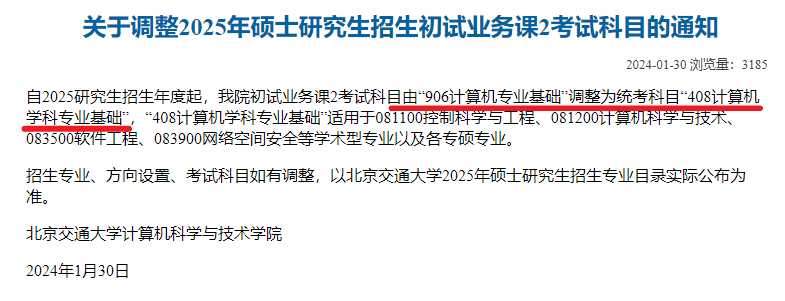

# BJTU_PostgraduateEntranceExamination
总结本人北交计算机学硕考研经历，希望能够对后来者有所帮助。

截止2023年4月20日，本人已成功拟录取，且完成了选导师的工作。

# !!!注意!!!

根据北京交通大学计算机与信息技术学院于2024年1月30日的[通知](https://scit.bjtu.edu.cn/cms/item/5348.html)，北京交通大学081100控制科学与工程、081200计算机科学与技术、083500软件工程、083900网络空间安全等学术型专业以及各专硕专业的考研专业课将由原来的906改为统考408，因此本仓库的专业课部分的经验已失去时效性，请大家注意。

# 话说在前面

本人纯凭兴趣维护这个仓库，仓库内容受限于本人狭隘的视野，必然会出现大量的谬误，请大家独立思考，不要盲信本仓库中的内容。

# 创建仓库的动机

截止2023年4月20日17:37为止，本人在Github上搜索“北交”+“计算机考研”等北交计算机考研相关关键词，所得结果只有一个2019年的Repository[(地址)](https://github.com/ditto-cc/UNGEE-925)。而北交计算机在2022年就改了计算机考研的考纲，即从 数据结构（925）和操作系统（923）二选一 改为 数据结构+操作系统（906）都考，因此本人认为这个仓库如果之后不更新的话可能已经不适合后来选考北交计算机的朋友们。

此外，其他计算机比较强的学校都搜到比较全面的仓库（包含初试、复试、导师信息等全面的资料），而截至2023年4月20日17:37为止Github上并没有（或者说我没搜到），我觉得这种情况可能会减北交计算机在各位考研er心中的印象分（推己及人），所以我突然有一种责任在我的感觉（毕竟马上北交就是我的学校了）。

综上，我决定创建这个仓库并尽力完善它。

还有就是，欢迎大家一起维护这个仓库！！！

如果你想要一起维护这个仓库，可以尝试联系这个邮箱:dogwangyan@163.com，邮件标题写成“狗东狗西+BJTU_PostgraduateEntranceExamination”，最好可以在邮件里写一下你的微信，就当交个朋友。

# 内容索引

- [初试相关](./初试相关)
- [复试相关](./复试相关)

> 初试部分网上的经验应该是铺天盖地, 本仓库中截止`2023/8/8`只简单收录了本人的考研经验, 网上一定有许多比本人整理的更加完善, 条理更加清楚的经验攻略, 因此希望大家能够取其精华弃其糟粕(虽然本人的经验可能糟粕比较多).
>
> 复试部分截止`2023/8/8`只收录了本人回忆的复试考题.

# 关于选取导师

本人在选取导师时主要参考了以下几个网站:

- [北交官方的导师目录](https://aa.bjtu.edu.cn/discipline/tutor_show/?college=02&teacher=)
- [谷歌学术](https://scholar.google.com.hk/?hl=zh-CN)

> 本人在北交的计算机学院并不认识人, 所以没有什么消息渠道, 因此只能参考这些官方的资料了

大概步骤:

1. 逐个浏览导师首页, 重点看毕业生去向, 横向项目、研究方向
2. 使用谷歌学术搜索导师, 查看导师近几年的论文
3. 根据毕业生去向、横向项目、论文、研究方向综合考虑导师选取

> 其实以上的方法也不是多么靠谱, 因为北交计算机的老师在这些方面都是比较强的(狗头保命!)
>
> 此外, 至于导师是否push, 是否放实习, 是否给劳务等等这些, 本人在选导师的时候就比较茫然, 不是很清楚. 大家如果有自己的渠道可根据自己的需求加以权衡.

# 资源列表

- 北京交通大学历年真题（2018年及之前 + 2022年真题）：https://www.aliyundrive.com/s/GG35xSysPFs

> 真题是我从淘宝购入的

- 红果考研三套专业课模拟卷（2023年版）：https://www.aliyundrive.com/s/ky5XfMno9mc 

> 非常私密马赛，本来我买的时候是有五套模拟卷的，但是在我考完回头找的时候只找到三套

- 学硕复试参考书（离散数学）： https://www.aliyundrive.com/s/sGMbqwjL3o5 

> 学硕复试的笔试部分23年时只考离散数学
